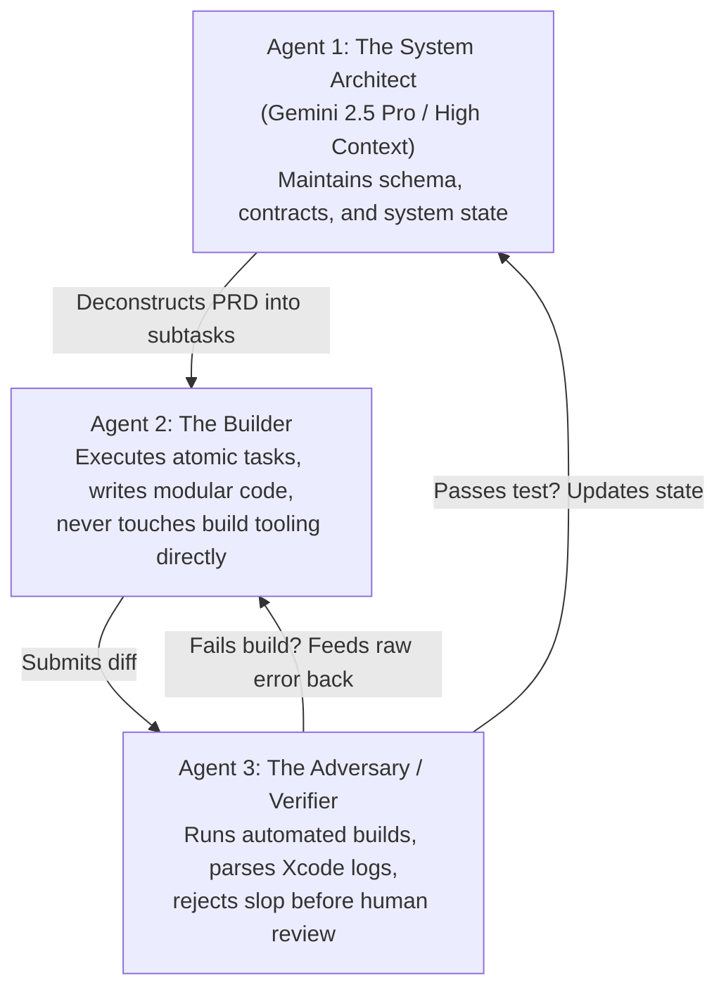

# The Non-Coder's Agentic Production Handbook
**By James Nunn (@JamesCantCode)**  
*0% Code. 100% Persistence. Live on the iOS App Store.*

---

## Executive Summary

Most software advice is written by developers for developers. It tells you to learn syntax, master data structures, and memorize terminal commands.

This handbook is the exact opposite. 

I work full-time as an enterprise tech sales director. I am a father of three young kids. I do not know Swift syntax, I cannot write raw React hooks from memory, and I have never written a SQL migration by hand. 

Yet today, **TickBucks** is live on the Apple App Store and Google Play, with real families using it across the UK, US, and Europe. 

Here is the exact production architecture, multi-agent loop, and operational system I used to burn **1.13 billion tokens** and ship production software without writing syntax.

---

## 1. The Absolute Prerequisite: Crystal-Clear Intent & The Art of Prompt Articulation

The biggest mistake non-coders make when sitting down in front of an AI agent is thinking the AI will invent their product for them.

It won't. 

If your idea is foggy in your own mind, the AI will deliver a bloated, disjointed hallucination. AI agents are world-class executors, but they are terrible mind readers. The single most important skill of the non-coder is **articulating your mental model with surgical clarity**.

### The 4 Golden Rules of Prompt Articulation:

#### 1. The "Kitchen Table" Test
Before opening Antigravity or typing a single prompt, describe the feature out loud as if explaining it to a 10-year-old at the kitchen table. 
* ❌ *Vague / Lazy:* "Build a chores app with points and rewards."
* ✅ *Articulated:* "My 7-year-old empties the dishwasher. She opens the app, taps her photo, punches in a 4-digit emoji PIN, taps a big green button that says 'Dishwasher Done', and hears a coin chime. Her balance increases from 5 to 6 coins. My parent phone gets an approval alert."

#### 2. Specify the Triad: Input $\rightarrow$ Mutation $\rightarrow$ Output
Never describe a screen in isolation. Always specify the state transition:
* **The Input:** What exact button or field does the user interact with?
* **The Mutation:** What database table or local state changes? (e.g. `balance = balance + 1`)
* **The Output:** What visual, haptic, or sound feedback does the user experience immediately?

#### 3. Define the Negative Space (Tell the Agent What NOT to Touch)
LLMs have a tendency to be "over-helpful" — they will refactor your auth system, install new npm libraries, and reformat your entire stylesheet if you let them.
* Always enforce negative boundaries:
  > *"Only touch `ChoreCard.tsx`. Do NOT touch authentication. Do NOT install external animation packages. Do NOT rewrite the parent container."*

#### 4. Paper Specs by Daylight, Agent Prompts by Night
Never enter a 10 PM build session with a blank screen. During your lunch break or commute, write the spec on physical paper:
* Screen layout sketch
* Button names
* Exact copy for error states
When you sit down at night, you aren't "figuring out what to build" — you are directing an agent against an already solved product spec.

---

## 2. The Core Philosophy: "Syntax is a Legacy Constraint"

Traditional software development treats coding as typing:
$$\text{Idea} \longrightarrow \text{Syntax (Human fingers)} \longrightarrow \text{Compiler} \longrightarrow \text{App}$$

Agentic development treats software engineering as **executive direction & boundary control**:
$$\text{Idea} \longrightarrow \text{Architecture & Intent} \longrightarrow \text{Multi-Agent Loop} \longrightarrow \text{Deterministic Verification} \longrightarrow \text{App}$$

When you stop trying to be the compiler and start acting as the product architect, your constraints change:
* You don't need to know how to write an async closure in Swift.
* You DO need to know what Apple's FamilyControls framework does, what entitlements are required, and how to verify that your data isn't leaking.

---

## 3. The Multi-Agent Operating System

I do not use AI as an autocomplete widget. I orchestrate specialized agents running inside **Antigravity** and **Gemini**:

### The 3-Agent Role Architecture



1. **The Architect (Gemini / High-Context Model):**
   * Holds the master specification, data contracts, and architectural rules.
   * Keeps track of what changed between sessions.
   * Prevents code bloat and circular dependencies.
2. **The Builder:**
   * Receives single, tightly bounded tasks (e.g. *"Implement the emoji-PIN keypad with haptic feedback"*).
   * Operates strictly against defined type interfaces.
3. **The Adversary / Verifier:**
   * Reads the real compilation outputs from Xcode / Capacitor.
   * Strips out hallucinations and tests against real runtime constraints.

---

## 4. The Autonomous Xcode Compilation & Recovery Loop

Shipping native iOS apps with AI usually fails at the **Xcode Wall**: provisioning profiles, entitlements, CocoaPods, and cryptic Swift compiler errors.

Here is the exact loop that conquered 4 Apple App Store rejections on TickBucks:

### Step 1: The Headless Build Command
Never ask an AI *"Why won't my Xcode build?"* It will hallucinate 10 random StackOverflow answers. Instead, run an isolated build script that captures the raw compiler diagnostics.

### Step 2: The "Error Isolation" Prompt
Feed the exact error log into the agent with this strict constraint:
> *"Here is the compiler error from `xcodebuild`. Do not rewrite unrelated files. Identify the missing type or signature mismatch in [File.swift], show the 5 lines before and after, and provide the exact replacement snippet."*

### Step 3: Entitlement Quarantine
When dealing with Apple FamilyControls / Screen Time APIs:
* Apple strictly requires specific entitlements (`com.apple.developer.family-controls`).
* We isolated all native Swift bridges into a modular Capacitor plugin rather than mixing native code into the cross-platform bundle.
* When Apple rejected the binary for permission descriptions, the agent generated the exact localized strings and Info.plist keys required by Apple's review team within 15 minutes.

---

## 5. The 1.13 Billion Token Correction Ledger

The secret to shipping production apps with agents is maintaining a **Correction Ledger** (a persistent rules file):

Every time an agent makes a mistake, **never fix it twice**. Log the mistake into your agent instructions:

```markdown
# Corrections & Architectural Constraints (JCC)
1. NEVER import Capacitor native plugins directly in Next.js SSR components; gate with `typeof window !== 'undefined'`.
2. All monetary calculations in TickBucks must use integer cents/pence (never floating-point numbers).
3. The Emoji-PIN auth state must persist in secure storage, not plaintext localStorage.
4. When editing Swift bridge files, always verify MainActor thread safety.
```

By session 50, your agent stops making 95% of common mistakes because your project ledger acts as an automated guardrail.

---

## 6. The Production Stack

For builders who want to ship fast without server DevOps:

| Layer | Technology | Why We Chose It |
| :--- | :--- | :--- |
| **Mobile Core** | Capacitor + Next.js | Single codebase for iOS, Android (Amazon Fire), and Web. |
| **Native APIs** | Swift (FamilyControls / StoreKit 2) | Native App Store compliance and Apple Screen Time integration. |
| **Database & Auth** | Supabase + NocoDB | Postgres reliability + Airtable-like visual back-office HUD. |
| **Agent Engine** | Antigravity + Gemini / Claude | Multi-agent autonomous terminal loops and deep reasoning. |
| **Creator Hub** | Astro + Tailwind (`jamescantco.de`) | Ultra-fast, zero-JS baseline with interactive Bento showcase. |

---

## 7. The Verdict

You do not need a computer science degree to ship software in 2026. 

You need:
1. **Crystal-clear articulation** of what you are building.
2. **Unforgiving persistence** to push through errors.
3. **Clear architectural constraints** so agents don't wander off.
4. **A repeatable verification loop** that grounds AI output in reality.

*0% Code. 100% Persistence.*
