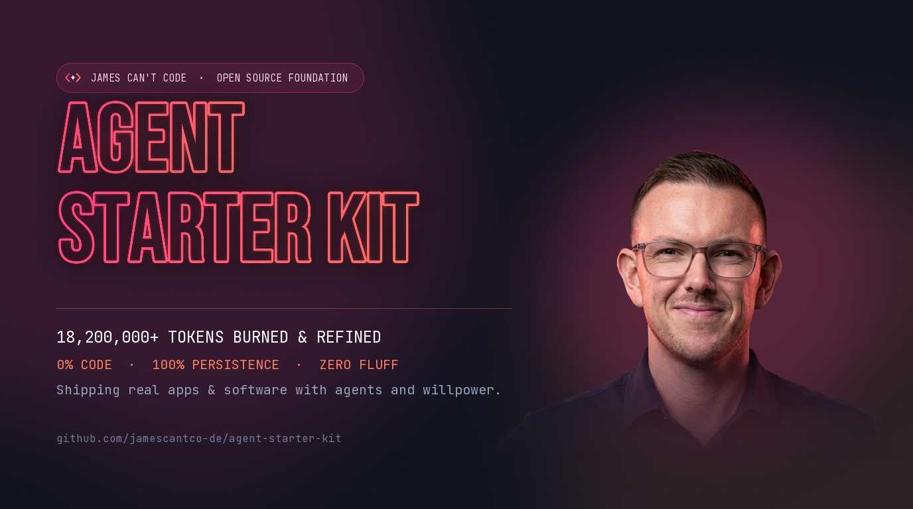

<p align="center">
  
</p>

# Agent Starter Kit

> **A battle-tested foundation for builders who don't write code — but build real software anyway.**  
> Curated by **James Can't Code** ([jamescantco.de](https://jamescantco.de) | [@JamesCantCode](https://x.com/JamesCantCode)).

---

## Why This Exists

If you have spent any time building software with AI coding agents (Claude Code, Google Antigravity, Gemini CLI, Cursor, Codex), you have probably noticed three frustrating walls:

1. **The Context Sinkhole**: Running raw shell commands, test suites, or git diffs burns through tens of thousands of tokens per prompt. Before you know it, the agent's context window is full of noise, response latency spikes, and your credit card takes a beating.
2. **The Groundhog Day Effect**: The agent makes an assumption, you correct it, and forty-five minutes later in a fresh context window, it makes the exact same mistake.
3. **Configuration Drift**: You have instructions in `CLAUDE.md`, different prompts in Cursor, and another set in Antigravity or Gemini. Nothing is in sync.

This repository is the exact architectural starter kit I arrived at after building production web apps, mobile PWAs, and automated workflows. It is designed to be simple, token-efficient, and easy to maintain.

---

## Core Philosophy & Architecture

```text
┌─────────────────────────────────────────────────────────────┐
│               TIER 1: BRAINS (Frontier LLMs)                │
│  Architecture · Trade-offs · System Design · Final Reviews  │
└──────────────────────────────┬──────────────────────────────┘
                               │
                               ▼
┌─────────────────────────────────────────────────────────────┐
│                 TIER 2: SKILLS (Procedural SOPs)            │
│    Structured prompt routines for repeatable workflows      │
└──────────────────────────────┬──────────────────────────────┘
                               │
                               ▼
┌─────────────────────────────────────────────────────────────┐
│             TIER 3: SCRIPTS (0-Token Determinism)           │
│   Bash/Node/Python scripts for mechanical formatting & checks│
└─────────────────────────────────────────────────────────────┘
```

### 1. The 3-Tier Execution Hierarchy
- **Tier 1 — Brains (Frontier LLMs)**: High-level strategic reasoning, edge-case evaluation, and architectural direction.
- **Tier 2 — Skills (Procedural SOPs)**: Markdown-based procedural routines in `skills/` that teach agents how to handle specific tasks (TDD, verification, brand tone).
- **Tier 3 — Scripts (0-Token Determinism)**: Local scripts in `scripts/` that handle mechanical operations (log parsing, data transformations, schema checks) without spending a single LLM token.

### 2. The 1-2-3 Rule
- **First time**: Work through the problem manually with the agent.
- **Second time**: Document the repeatable sequence as a procedural skill.
- **Third time in a week**: Automate it into a local script. Never spend LLM tokens on mechanical work that a 10-line script executes in 5 milliseconds.

### 3. Self-Healing Correction Rules
Located in `Correction Rules.md`, this is an append-only ledger of hard lessons learned. Every time an agent makes a mistake, logs an anti-pattern, or assumes something incorrectly, add one concise rule to the file. Agents read this file before touching code. **A mistake corrected once is never repeated.**

### 4. Single Source of Truth (`agentsync.toml`)
Rather than managing separate prompt files for every tool, manage one canonical `AGENTS.md` and symlink it out to:
- `CLAUDE.md` (Claude Code)
- `GEMINI.md` / `ANTIGRAVITY.md` (Google Gemini / Antigravity)
- `.github/copilot-instructions.md` (GitHub Copilot)
- `.cursor/` & `.codex/`

### 5. Context Preservation & Token Economics (RTK)
The silent killer in agentic coding is terminal bloat. A single `git diff` or test runner dump can swallow 50,000 characters of context in seconds, polluting the model's memory. In this setup, we run **[RTK (Rust Token Killer)](https://github.com/rtk-ai/rtk)** as a transparent CLI proxy. It automatically intercepts shell commands (`git`, `diff`, `log`, tests) and filters repetitive noise before it hits the LLM, preserving 60–90% of tokens on terminal operations (recording over 18.2M tokens saved on my machine at 97%+ efficiency).

---

## Directory Structure

```text
agent-starter-kit/
├── README.md               # You are here
├── LICENSE                 # MIT License
├── AGENTS.md               # Master instruction template for all agents
├── CLAUDE.md               # Symlink to AGENTS.md for Claude Code
├── GEMINI.md               # Symlink to AGENTS.md for Gemini / Antigravity
├── Correction Rules.md     # Self-healing rules ledger
├── agentsync.toml          # Multi-agent symlink synchronization config
├── skills/                 # 12 Production SuperSkills & Foundations
│   ├── security-audit/     # APIs, auth boundaries, OWASP, spend caps, contracts
│   ├── performance-review/ # Core Web Vitals, React re-renders, DB slow queries
│   ├── quality-engineering/# GateGuard, TDD red-green loops, verification gates
│   ├── design-polish/      # Design engineering, typography scales, active states
│   ├── motion-engineering/ # Standardised spring tokens, layout transitions, a11y
│   ├── database-ops/       # Schema design, indexing, zero-downtime migrations
│   ├── cloud-data-pipelines/# BigQuery SQL, data quality, Dataflow / Beam
│   ├── fullstack-mobile/   # SwiftUI @Observable, Swift 6.2 concurrency, KMP
│   ├── social-content-engine/# Multi-platform drafting, format matrices, direct APIs
│   ├── programmatic-video/ # React Remotion, Manim technical diagrams, FFmpeg
│   ├── commercial-revops/  # Product Lens, investor memos, B2B lead intelligence
│   ├── agent-orchestration/# Multi-agent swarms, parallel DevFleet worktrees
│   ├── tdd-workflow/       # Test-driven development gate
│   ├── verification-loop/  # Deterministic checks before claiming completion
│   ├── script-optimizer/   # The 1-2-3 Rule workflow
│   └── brand-voice/        # Anti-cliché voice and style guide
└── scripts/                # 0-token deterministic helper utilities
    ├── verify_setup.sh     # Quick health check for your agent environment
    └── token_audit.py      # Lightweight stream inspector
```

---

## Quickstart (5 Minutes)

### 1. Clone the repository
```bash
git clone https://github.com/jamescantco-de/agent-starter-kit.git my-project
cd my-project
```

### 2. Run the environment verification
```bash
./scripts/verify_setup.sh
```

### 3. Customise `AGENTS.md`
Open `AGENTS.md` and tailor Section 1 with your own project context, tech stack, and working style. Because `CLAUDE.md` and `GEMINI.md` are symlinked, editing `AGENTS.md` automatically updates all your tools.

### 4. (Optional) Install RTK for CLI Token Savings
If you run coding agents that execute terminal commands (`git diff`, `npm test`, `git log`), look into CLI proxying tools like [RTK (Rust Token Killer)](https://github.com/rtk-ai/rtk) to filter terminal noise and save 60–90% of your context tokens on shell operations.

---

## The 5-Part Agent Architecture Series

This starter kit is accompanied by our deep-dive publication series:
1. **Part 1**: [1.13 Billion Tokens Burned... And Counting](OVERVIEW.md) — The foundation, token economics with RTK, and the 1-2-3 rule.
2. **Part 2**: [The 40-Year-Old Design Rule That Fixed My AI Agent's Memory](SUPERSKILLS.md) — Progressive disclosure and the SuperSkills architecture.
3. **Part 3**: [The Production Shield](PRODUCTION_SHIELD.md) — Security audits, quality engineering gates, database indexing, and performance.
4. **Part 4**: [Taste as Code](TASTE_AS_CODE.md) — Design engineering, spring physics tokens, and Apple optical glass.
5. **Part 5**: [The Autonomous Studio](AUTONOMOUS_STUDIO.md) — Parallel Git worktrees, 4-Voice Decision Councils, and programmatic video.

Looking for the standalone SuperSkills repository with all 12 skills and reference checklists? Check out **[SuperSkills on GitHub](https://github.com/jamescantco-de/superskills)**.

---

## Influences & Acknowledgements

This setup stands on the shoulders of brilliant work in the AI engineering community:
- **Everything Claude Code (ECC)**: For pioneering modular skills and local agent conventions.
- **Anthropic Research**: For foundational work on agent evaluation loops and harness design.
- **The Unix Philosophy**: "Write programs that do one thing and do it well. Write programs to work together."

---

## Licence

MIT © [James Can't Code](https://jamescantco.de). Feel free to use, modify, and distribute this in your own personal and commercial projects.
